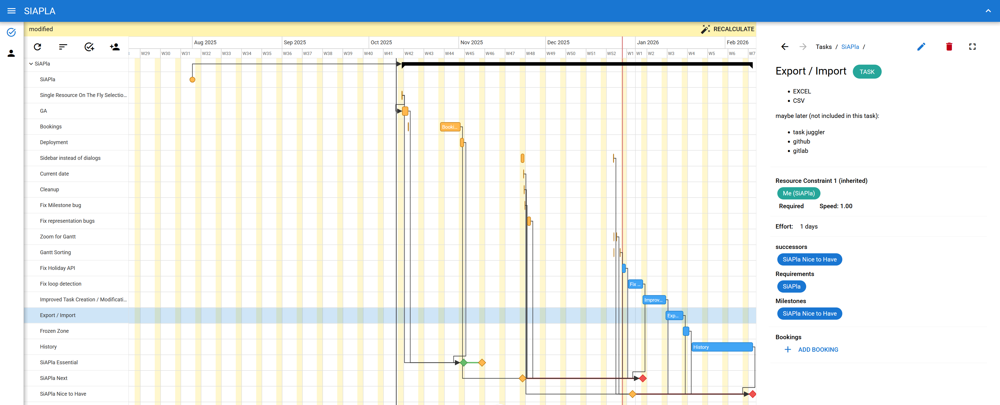

# SIAPLA - A simple agile planning tool



Automatically creates plans based on requirements, resource constraints and target milestones.

## Installation

SIAPLA serves a webpage. The installation methods below result in a webpage being available at http://localhost:8990.

### Docker (recommended)

```
mkdir ~/siapla-data
docker run --name siapla -v ~/siapla-data:/data -p 8990:80 -d valgarf/siapla:latest
```

### Cargo

```
mkdir ~/siapla-data
cargo install siapla
```
Note: You can also use `cargo-binstall` but currently the binary is always compiled from source.

Run it with
```
siapla-serve --database-url sqlite:$HOME/siapla-data/default.sqlite --bind 0.0.0.0:8990
```

## Upgrades

Backup the database at `~/siapla-data/default.sqlite` before upgrading!

The code automatically runs all necessary database migrations on startup.
Simply starting the latest docker or install and run the latest cargo package is sufficient to upgrade to the latest version.

## Downgrade

If you want to downgrade to a previous version: Stop the docker or process, restore the old database, start the old version. You must use the backup of your old database. All modifications done with the new version are then lost.

Note: downgrades are implemented but not tested very well.
You can try to downgrade a database using the `just migrate` command.
This is only intended for development and you will need to set up a development environment.

## Development

SIAPLA consists of a backend written in Rust - with [Axum](https://github.com/tokio-rs/axum) as web framework, [Juniper](https://github.com/graphql-rust/juniper) for GraphQL, and [Sea ORM](https://www.sea-ql.org/SeaORM/) as ORM - and a frontend using the [Quasar Framework](https://quasar.dev/)

### Setup 

This repository relies heavily on [just](https://just.systems/) for running development tasks. Just runs the commands written in the `justfile`.

For database operations, [Sea ORM](https://www.sea-ql.org/SeaORM/) is used. Some just commands expect `sea-orm-cli` to be available, install it with `cargo install sea-orm-cli`.

Run 
```
just init
```
to initialize the workspace.

To serve the backend, run
```
just serve-backend-release
```
and the website is available at http://localhost:8880.
It automatically rebuilds and restarts the backend in case of changes to the backend code.

The backend only serves a frontend that has been built with `just build-frontend`.
When modifying the frontend, it is easier to also run
```
just serve-frontend
```
which will serve the frontend to http://localhost:9000 using the quasar dev server. Any changes to frontend code will be immediatly visible without rebuilding the whole frontend. The dev frontend communicates to the backend using the
http://localhost:8880/graphql and ws://localhost:8880/subscriptions endpoints.